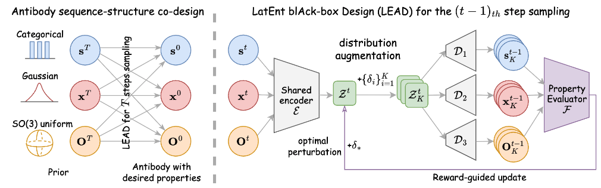

# LatEnt blAck-box Design (LEAD)

This repository contains the code for the paper: "Generative Co-Design of Antibody Sequences and Structures via Black-Box Guidance in a Shared Latent Space (IJCAI 25)".


*Figure: Overall framework. **Left panel** describes the whole process of our guided sampling. **Right panel** details the black-box guidance incorporated in the shared latent space of sequence and structure.*


## Unconditional Sampling (DiffAb) & Property guided Sampling (our LEAD)

Single sample
```bash
bash test_run.sh
```
Test set
```bash
bash testset_run.sh
```

### Datasets and model weights

Protein structures in the **SAbDab** dataset for training and testing can be downloaded [here](https://opig.stats.ox.ac.uk/webapps/newsabdab/sabdab/archive/all/). Extract `all_structures.zip` into the `data` folder. The `data` folder contains a snapshot of the dataset index (`sabdab_summary_all.tsv`).

[[DiffAb]](https://github.com/luost26/diffab) model weights can be downloaded from either [[Hugging Face]](https://huggingface.co/luost26/DiffAb/tree/main) or [[Google Drive]](https://drive.google.com/drive/folders/15ANqouWRTG2UmQS_p0ErSsrKsU4HmNQc?usp=sharing). Copy the files into the `trained_models` folder. The model weights for [[DDG Predictor]](https://github.com/HeliXonProtein/binding-ddg-predictor) can be found in [`diffab/tools/ddg/data/model.pt`](diffab/tools/ddg/data/model.pt).

### Configuration

The config files are in the `configs/test` folder. To design the six CDRs separately, use the `codesign_single` model and config on the scripts `design_pdb.py` (one sample) and `design_testset.py` (full test set, 19 samples). The lists of options are in the scripts [`diffab/tools/runner/design_for_pdb.py`](diffab/tools/runner/design_for_pdb.py) and [`diffab/tools/runner/design_for_testset.py`](diffab/tools/runner/design_for_testset.py), respectively.

For sampling by property (ddG, hydropathy, or both), use the following config files:

| Config file              | Description                                                  |
| ------------------------ | ------------------------------------------------------------ |
| `codesign_single_ddg.yml` | Sequence-structure of one CDR, **sampling by ddG**. |
| `codesign_single_hydro.yml` | Sequence-structure of one CDR, **sampling by hydropathy**. |
| `codesign_single_ddg_and_hydro.yml` | Sequence-structure of one CDR, **sampling by ddG and hydropathy**. |

## Acknowledgements

This repository builds upon [(Luo et al. 2022) [DiffAb]](https://github.com/luost26/diffab) and [(Morcillo et al. 2024)](http://github.com/amelvim/antibody-diffusion-properties). Thanks to their contribution.

## References

If you find this repository useful in your research, please cite the following works.

```bibtex
@article{lead25,
  title={Generative Co-Design of Antibody Sequences and Structures via Black-Box Guidance in a Shared Latent Space},
  author={Yinghua Yao, Yuangang Pan and Xixian Chen},
  journal={IJCAI},
  year={2025}
}
```
